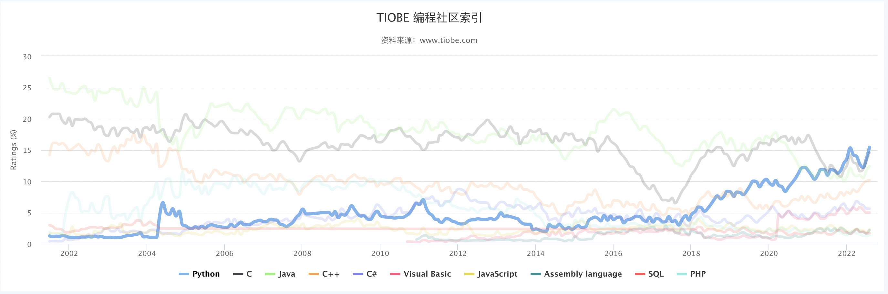

# Python 简介
Python 是著名的 Guido van Rossum 在1989年圣诞节期间，为了打发无聊的圣诞节而编写的一个编程语言。

现在，全世界差不多有 600 多种编程语言，但流行的编程语言也就那么 20 来种。如果你听说过 TIOBE 排行榜，你就能知道编程语言的大致流行程度。这是最近 20 年最常用的 10 种编程语言的变化图：

目前，Python 因为其 **"万能"** 的特性，被广泛应用。除高性能安全关键的嵌入式系统，现在很难找到一个没有广泛使用 Python 的编程领域。

尤其是最近较为火热的 AI 领域，由于 Pytorch 和 TensorFlow 的存在，Python 被认为是最好的 AI 编程语言。

所以，我们从 Python 入门，学习计算机编程相关知识，并且掌握一些基本的数据结构和算法。

# Python 语言特点

Python 是一个高层次的结合了解释性、编译性、互动性和面向对象的脚本语言。

Python 的设计具有很强的可读性，相比其他语言经常使用英文关键字，其他语言的一些标点符号，它具有比其他语言更有特色语法结构。

- Python 是一种解释型语言： 这意味着开发过程中没有了编译这个环节。类似于PHP和Perl语言。

- Python 是交互式语言：这意味着在交互式解释器中，你可以在一个 Python 提示符 `>>> ` 后直接执行代码。

- Python 是面向对象语言: 这意味着Python支持面向对象的风格或代码封装在对象的编程技术。

- Python 是初学者的语言：Python 对初级程序员而言，是一种伟大的语言，它支持广泛的应用程序开发，从简单的文字处理到 WWW 浏览器再到游戏。

# Python 生态

当你用一种语言开始作真正的软件开发时，你除了编写代码外，还需要很多基本的已经写好的现成的东西，来帮助你加快开发进度。比如说，要编写一个电子邮件客户端，如果先从最底层开始编写网络协议相关的代码，那估计一年半载也开发不出来。高级编程语言通常都会提供一个比较完善的基础代码库，让你能直接调用，比如，针对电子邮件协议的SMTP库，针对桌面环境的GUI库，在这些已有的代码库的基础上开发，一个电子邮件客户端几天就能开发出来。

Python就为我们提供了非常完善的基础代码库，覆盖了网络、文件、GUI、数据库、文本等大量内容，被形象地称作“内置电池（batteries included）”。用Python开发，许多功能不必从零编写，直接使用现成的即可。

除了内置的库外，Python还有大量的第三方库，也就是别人开发的，供你直接使用的东西。当然，如果你开发的代码通过很好的封装，也可以作为第三方库给别人使用。

许多大型网站就是用Python开发的，例如YouTube、Instagram，还有国内的豆瓣。很多大公司，包括Google、Yahoo等，甚至NASA（美国航空航天局）都大量地使用Python。

龟叔给Python的定位是“优雅”、“明确”、“简单”，所以Python程序看上去总是简单易懂，初学者学Python，不但入门容易，而且将来深入下去，可以编写那些非常非常复杂的程序。

总的来说，Python的哲学就是简单优雅，尽量写容易看明白的代码，尽量写少的代码。如果一个资深程序员向你炫耀他写的晦涩难懂、动不动就几万行的代码，你可以尽情地嘲笑他。

**点击"Run"按钮，你将看到"Python 之禅"，点击"Next"进入下一章节**