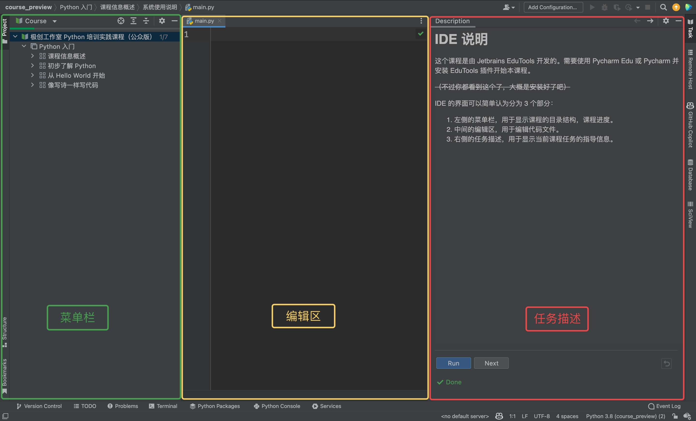

# IDE 说明
这个课程是由 Jetbrains EduTools 开发的。需要使用 Pycharm Edu 或 Pycharm 并安装 EduTools 插件开始本课程。

<del>（不过你都看到这个了，大概是安装好了吧）</del>

# 界面分区
IDE 的界面可以简单认为分为 3 个部分：

1. 左侧的菜单栏，用于显示课程的目录结构，课程进度。
2. 中间的编辑区，用于编辑代码文件。
3. 右侧的任务描述，用于显示当前课程任务的指导信息。

## 菜单栏

如你所见，我们的课程以"课程列表"的方式构成，每个课程中都有多个任务。在本次课程中，该区域基本不需要操作。

如果你成功完成通过了一个任务，你会发现任务由一个白色方框变为了绿色方块。当全部任务都变为绿色方块时，祝贺你，你已经完成了课程的全部内容！

如果你想回退到之前的任务，你可以点击菜单栏中对应的任务。

要隐藏课程视图窗口，请单击 **"Project"** 按钮或按 **&shortcut:ActivateProjectToolWindow;** . 这将为编辑器和任务描述窗口提供更多空间。
如需恢复显示，你可以再次单击 **"Project"** 按钮或按 **&shortcut:ActivateProjectToolWindow;** 。

## 编辑区
编辑区是编辑代码的主要区域，你可以在这里编辑代码文件、跟随右侧任务描述进行操作、在遇到小测试时进行实验。

对于最后的"实践练习"任务，你可以在编辑器中修改我们提供的代码，也可以从头开始编写自己的代码。

需要运行代码？你可以右键编辑区，在菜单中选择"Run"开头的选项，你也可以选择按 **&shortcut:Run;** 运行代码。

## 任务描述区
任务描述区是显示课程内容的区域。

此处分为几种情况：

- 显示课程内容，底部"Run"、"Next"两个按钮都直接显示：该任务为理论指导内容，你需要阅读材料并尽量理解
- 底部显示多个选项及"Check"按钮：该任务为小测试，你需要完成单选或多选题，点击"Check"，如你回答正确则可以点击"Next"进入下一步
- 底部没有选项展示，仅有"Check"按钮：该任务为实践练习任务，你需要按照课程要求完成任务，点击"Check"，如你的代码是正确的则可以点击"Next"进入下一步

强烈建议 **不要** 关闭这个区域！如果你发现这里太占地方，你可以通过拖拽分区间分割线来调整大小。

现在，请点击 **"Next"** 按钮，开始你的学习之旅吧！