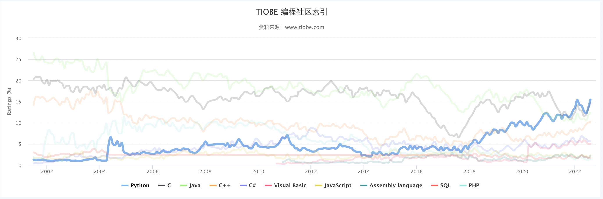

# 课程说明

欢迎来到Python入门课程！本课程由 [极创工作室](https://geek-tech.club) 设计开发，主要面向我校没有编程基础的同学，快速上手学习 Python。

这个课程是完全免费且 [开源](https://github.com/GeekTechStudio/LearnPython) 的，如您对本课程有更多建议和优化方案，欢迎您提交 Pull Request。

课程预计时长为 1 小时，我们会通过构建一个 "数字动物园" 来帮助你快速了解 Python 的部分内建函数、字符串、字典、注释等内容。

# 为什么是 Python

通过 TIOBE 指数不难看出，Python 已经成为了全球最受欢迎的编程语言。Python 广泛应用于数据科学、机器学习、自然语言处理、人工智能等领域，是增长最快的主要编程语言。

Python 的特点是非常简单易学，适合初学者学习。 所以，这会是一个非常好的熟悉编程的起点。Python 比大多数其他编程语言更容易阅读、编写和学习。同时其学习曲线较为平滑，每个人都能快速上手。而不是困于调试简单的问题中（或者说新手易犯得看起来很"愚蠢"的问题，将极大程度的离你远去）。

此外，Python 的第三方库生态非常完善，在中文互联网上，Python 的文档、社区、问答都是非常容易找到的，这将在你遇到问题时有的查、有人问，这将帮助您在学习时不会因为一些常规性问题被阻碍，保持继续向前的动力。

# 面向对象

你无需任何 Python 或其他编程方面的知识，需要的是一点耐心和一点精力。

**祝你好运！**